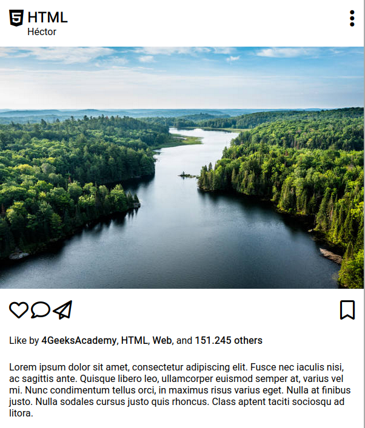

# Instagram Post: HTML/CSS

Instagram es una de las interfaces de usuarios más populares del mundo, este es el primero de los tres ejercicios que te harán replicar las partes más importantes y difíciles de Instagram.com

En este caso, estamos empezando con una sola publicación (post).

## 🌱 ¿Cómo se debe ver?

## Instrucciones

Crea los archivos HTML y CSS necesarios para replicar esta misma imagen.

## Estrategia

Comienza por identificar que `<tags>` (etiquetas) html puedes usar para este sitio web, por ejemplo: `
`, `
`, etc.

Este website utiliza Roboto-type font de Google Fonts y Font Awesome:

- Font Awesome: [https://fontawesome.com/](https://fontawesome.com/)
- Google Font: [https://fonts.google.com/](https://fonts.google.com/)

> ⚠️ Importante:
> 
> Puedes utilizar una CDN para importar Font Awesome en lugar de buscarlo por la página oficial.

## Este ejercicio cubre los siguientes fundamentos:

- Estructura básica para cada sitio web HTML5.
- La etiqueta `<link>` para importar reglas CSS.
- Utilizar fuentes de google.
- Usar diferentes selectores disponibles en CSS.
- Trabajar con cajas: borde, relleno y márgenes.
- Overflow.
- Utilizar Flex vs Position vs Float vs Display.
